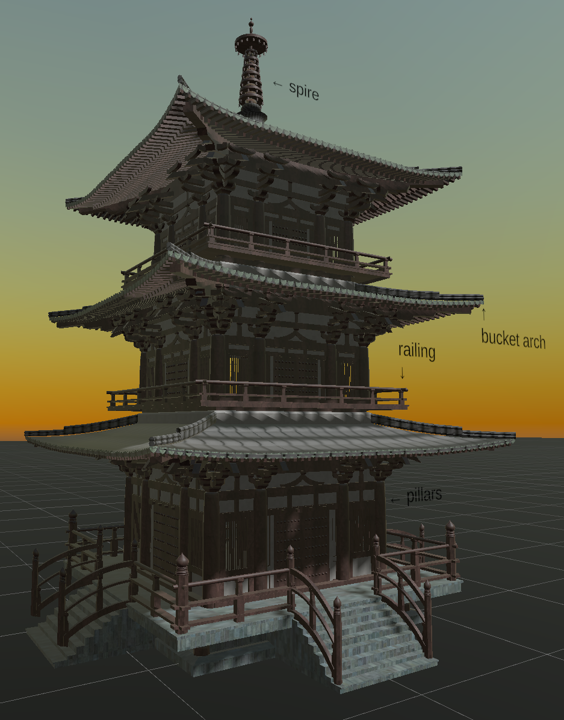
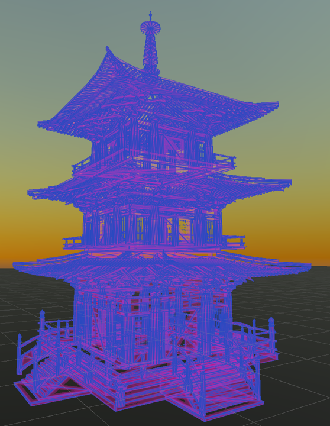

# VR Ancient Architecture Exhibition and Learning Platform

This is a VR project that showcases and teaches about ancient Chinese architecture using Unity engine and Oculus Quest 2 device. The project was created by Yang Ruitian as the final project for the course "Virtual Reality Development Practice" in the 2022-2023 academic year. The project aims to respond to the national call of "inherit and promote the excellent traditional Chinese culture". The project allows users to interact with virtual ancient buildings using hand gestures and learn about their history and culture. The project provides two modes of appreciation: realistic and perspective. In the realistic mode, users can also learn more details about the parts of the ancient buildings through knowledge cards.

## Development Environment

The software and plugins used for this project are:

- Unity 2021.3.11f1c2 + Android support
- 3D Max 2023
- Blender 3.3.1
- Oculus 2022/12
- Oculus XR Plugin 3.0.2
- XR Plugin Management 4.2.0
- XR Interaction Toolkit 2.0.4
- TextMesh Pro 3.0.6
- Unity-wireframe-shader

## How to Config

To run this project, you need to install Oculus software on Windows platform and connect Quest 2 device using Link / Airlink. You also need to install the corresponding version of Unity Editor and Android Build Support for publishing the app. You need to enable hand tracking feature on VR device, which is an experimental feature and disabled by default.

Screenshots:

## How to Use

There are two ways to run this project:

- Debug version: Oculus Link
  Due to Oculus limitation, hand tracking feature is only supported on Unity Editor and VR device, not on Windows build. To run this project in debug mode, open Unity Editor, configure according to the development environment, connect VR device using cable, enable Oculus Link, and run the project.
- Release version: Standalone VR app
  A VR app package is provided for this project. To install it, you need to install SideQuest, enable developer mode on Quest 2 device, and install the app package through computer. After installation, you can find Unknown Sources - VR Scene app on Quest 2 device and run it.

Note: This project has only been tested on Oculus Quest 2 device, compatibility with other VR devices is not guaranteed.

## Some Spotlights
Some features of this project are:

- Hand gesture interaction: Users can use their hands instead of controllers to interact with virtual ancient buildings, such as pressing buttons, scaling and rotating models.
- Two modes of appreciation: Users can switch between realistic mode and perspective mode to view the ancient buildings in different styles. In realistic mode, users can also see knowledge cards that introduce the parts of the ancient buildings.
- Ancient architecture models: The project includes four models of ancient Chinese architecture: Temple of Heaven, Forbidden City, Summer Palace, and Great Wall. The models are made with high quality and realism using 3D Max and Blender software.
- Two rendering techniques: The project uses two different rendering techniques for the ancient buildings: realistic rendering and wireframe rendering. Realistic rendering uses Unity Standard Shader to show the textures and details of the models. Wireframe rendering uses Unity-wireframe-shader plugin to show the outlines and shapes of the models in a stylized way.

The following image chart shows the comparison between the two rendering techniques:

| Realistic Rendering                       | Wireframe Rendering                       |
| ----------------------------------------- | ----------------------------------------- |
|  |  |
